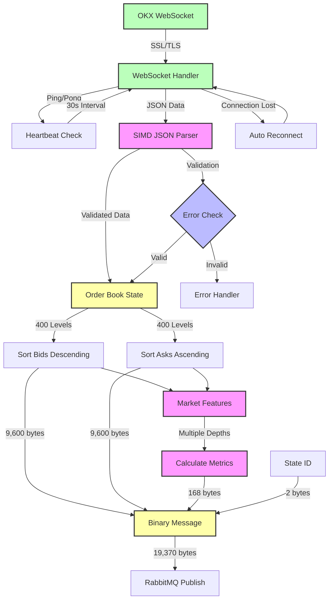

# OKX Orderbook Service

## Overview
The OKX Orderbook Service is a high-performance C++ application that connects to OKX's WebSocket API to receive real-time order book data for cryptocurrency trading pairs. It maintains a local order book state and publishes both raw order book data and calculated market microstructure features to a RabbitMQ message queue for downstream consumers.

## Features
- Real-time WebSocket connection to OKX exchange with SSL/TLS support
- Full L2 order book maintenance with strict 400-level validation
- High-performance JSON parsing using simdjson
- Custom fast string-to-double conversion
- Binary search for efficient price level updates
- Market microstructure feature calculations:
  - Mid price
  - Volume imbalance at multiple depths
  - Order imbalance at multiple depths
  - VWAP at multiple depths
- RabbitMQ integration with durable topic exchange
- Automatic reconnection and error handling
- 30-second interval ping/pong heartbeat mechanism
- JSON message validation with simdjson
- Fragment handling for large messages
- Performance monitoring with microsecond precision

## Architecture

### Scheme


### Core Components

#### WebSocket Client
- Manages secure WebSocket connection to OKX with libwebsockets
- Handles connection lifecycle and automatic reconnection
- Implements 30-second ping/pong mechanism
- Processes message fragments with proper buffer management
- Full SSL/TLS support with modern cipher configuration (HIGH:!aNULL:!MD5:!RC4)
- Configurable rx buffer size (262,144 bytes)
- Supports self-signed certificates and hostname verification skip for testing
- JSON validation before message processing
- Efficient message buffer management for fragmented messages
- Thread-safe message callback system

#### Order Book Handler
- Maintains order book state (exactly 400 levels per side)
- Processes updates and snapshots using simdjson for efficient parsing
- Implements binary search with custom comparators for price level lookup
- Custom fast string-to-double conversion for numeric values
- Strict validation of order book state:
  - Enforces exactly 400 levels per side
  - Throws detailed runtime error if level count is incorrect
  - Validates before any update is published
- Proper handling of price level updates:
  - Removes levels when volume becomes 0
  - Updates existing levels with precision handling
  - Inserts new levels with correct sorting
- Maintains 10-state history for feature calculations
- State tracking and identification:
  - Maintains a rolling state ID (0-65535)
  - Increments ID with each published update
  - Attaches ID to outgoing messages
  - Enables end-to-end state tracking
- Performance monitoring:
  - Tracks processing time for each message
  - Calculates moving average over last 100 messages
  - Reports microsecond-precision timing statistics
- Publishes updates to RabbitMQ in optimized binary format

#### RabbitMQ Handler
- Manages persistent RabbitMQ connection with environment variable configuration
- Handles both JSON and binary message publishing
- Implements durable topic exchange "orderbook"
- Automatic channel and exchange declaration
- Configurable connection parameters via environment variables:
  - RABBITMQ_HOST (default: "localhost")
  - RABBITMQ_PORT (default: 5672)
  - RABBITMQ_USER (default: "guest")
  - RABBITMQ_PASS (default: "guest")
- Persistent delivery mode for messages
- Error handling and reconnection logic

## Data Flow and Formats

### Internal Data Structures
```cpp
// Raw order book level
struct OrderBookLevel {
    double price;   // Price level
    double volume;  // Total volume at this price
    double orders;  // Number of orders at this price
};

// Market features
struct OrderBookFeatures {
    double midPrice;
    std::array<double, 5> volumeImbalance;  // For levels 10, 20, 50, 100, 400
    std::array<double, 5> orderImbalance;   // For levels 10, 20, 50, 100, 400
    std::array<double, 5> bidVwapChange;    // Bid VWAP % change relative to mid price
    std::array<double, 5> askVwapChange;    // Ask VWAP % change relative to mid price
    std::array<size_t, 5> depthLevels = {10, 20, 50, 100, 400};
};
```

### Message Flow
1. Incoming Data (OKX WebSocket):
   ```json
   {
       "bids": [
           [price, size, deprecated, orders_count],  // 4 elements array
           ...
       ],
       "asks": [
           [price, size, deprecated, orders_count],  // 4 elements array
           ...
       ],
       "ts": timestamp
   }
   ```
   Where:
   - `price`: String, price level
   - `size`: String, size/volume at this price
   - `deprecated`: String, deprecated field (ignored)
   - `orders_count`: String, number of orders at this price
   - `ts`: Number, OKX server timestamp

2. Internal Processing:
   - Converts strings to doubles with precision handling
   - Maintains sorted vectors of OrderBookLevel structs
   - Maintains history of last 10 states for each side
   - Uses binary search with custom comparators for updates
   - Validates 400 levels per side with runtime error handling
   - Calculates market microstructure features:
     - Mid price as average of best bid and ask
     - Volume and order imbalances with zero-value handling
     - VWAP calculations at multiple depths

3. Outgoing Data (RabbitMQ):

   Exchange: `orderbook` (durable topic exchange)
   Routing Key: `orderbook.updates`
   Content Type: `application/octet-stream`
   Delivery Mode: Persistent (2)

   Binary Message Format:
   ```
   [Bids Array: 400 levels × 3 uint64_t values]
   - Each level:
     * Price (8 bytes): 1 bit sign + 63 bits fraction
     * Volume (8 bytes): 1 bit sign + 10 bits whole + 53 bits fraction
     * Orders (8 bytes): 1 bit sign + 10 bits whole + 53 bits fraction
   - Total: 400 × 24 bytes = 9,600 bytes
   - Sorted in descending order by price

   [Asks Array: 400 levels × 3 uint64_t values]
   - Each level:
     * Price (8 bytes): 1 bit sign + 63 bits fraction
     * Volume (8 bytes): 1 bit sign + 10 bits whole + 53 bits fraction
     * Orders (8 bytes): 1 bit sign + 10 bits whole + 53 bits fraction
   - Total: 400 × 24 bytes = 9,600 bytes
   - Sorted in ascending order by price

   [Market Features]
   - Mid Price Change (8 bytes): 1 bit sign + 63 bits fraction
   - For each depth (10, 20, 50, 100, 400):
     * Volume Imbalance (8 bytes): 1 bit sign + 63 bits fraction
     * Order Imbalance (8 bytes): 1 bit sign + 63 bits fraction
     * Bid VWAP Change (8 bytes): 1 bit sign + 63 bits fraction
     * Ask VWAP Change (8 bytes): 1 bit sign + 63 bits fraction
   - Total: 1 + (5 × 4) × 8 bytes = 168 bytes

   [State ID]
   - 2 bytes unsigned integer (0-65535)
   - Increments with each message
   - Wraps around to 0 after 65535
   - Used for tracking state processing through the pipeline
   ```

   Value Encoding Details:
   1. Change Values (prices, imbalances, VWAP changes):
      - Format: 1 bit sign + 63 bits fraction
      - Sign bit: 0 for positive, 1 for negative
      - Fraction: value * (2^63 - 1)
      - Used for relative changes and ratios
      - Zero values encoded as 0
      - Precision threshold: 1e-15

   2. OrderBook Values (volumes and order counts):
      - Format: 1 bit sign + 10 bits whole + 53 bits fraction
      - Sign bit: 0 for positive, 1 for negative
      - Whole part: up to 1023 (10 bits)
      - Fraction: fractional_part * (2^53 - 1)
      - Used for absolute values that need whole number precision
      - Range: [-1023.9999..., 1023.9999...]
      - Zero values encoded as 0

   Total Message Size:
   - Bids: 9,600 bytes
   - Asks: 9,600 bytes
   - Market Features: 168 bytes
   - State ID: 2 bytes
   - Total: 19,370 bytes per message

## Market Microstructure Features

### Feature Depths
All features are calculated at multiple depths to capture different market dynamics:
- 10 levels (very short-term market pressure)
- 20 levels (short-term market pressure)
- 50 levels (medium-term market pressure)
- 100 levels (longer-term market pressure)
- 400 levels (full order book state)

### Feature Calculations

#### Mid Price
- Simple average of best bid and best ask prices
- Formula: `(best_bid + best_ask) / 2.0`
- Returns 0.0 if either side is empty
- Used as reference price for other calculations

#### Volume Imbalance
- Measures the relative difference between bid and ask volumes
- Formula: `(bidVolume - askVolume) / (bidVolume + askVolume)`
- Range: [-1, 1]
  - +1: All volume on bid side (strong buying pressure)
  - -1: All volume on ask side (strong selling pressure)
  - 0: Equal volume on both sides or zero total volume
- Calculated at all feature depths
- Zero handling: returns 0.0 if total volume is 0

#### Order Imbalance
- Measures the relative difference between number of bid and ask orders
- Formula: `(bidOrders - askOrders) / (bidOrders + askOrders)`
- Range: [-1, 1]
  - +1: All orders on bid side
  - -1: All orders on ask side
  - 0: Equal number of orders or zero total orders
- Calculated at all feature depths
- Zero handling: returns 0.0 if total orders is 0

#### VWAP Changes
- Separate calculations for bid and ask sides
- Each VWAP calculated as weighted average price up to depth
- Formula for each side:
  ```cpp
  VWAP = Σ(price × volume at each level) / Σ(volume at each level)
  ```
- Both bid and ask VWAPs compared to mid price:
  ```cpp
  bid_vwap_change = (bid_vwap - mid_price) / mid_price
  ask_vwap_change = (ask_vwap - mid_price) / mid_price
  ```
- Range: Unbounded, represents percentage difference from mid price
- Calculated at all feature depths
- Positive values indicate VWAP above mid price
- Negative values indicate VWAP below mid price
- Zero handling: returns 0.0 if no volume at specified depth

## Technical Details

### Order Book Update Rules
1. For each update:
   - If size is 0: Remove the price level
   - If price exists: Update size and orders count
   - If price is new: Insert at correct position
2. Binary search is used for efficient price level lookup O(log n)
3. Proper sorting is maintained:
   - Asks: Ascending order by price (400 levels)
   - Bids: Descending order by price (400 levels)
4. Strict validation ensures exactly 400 levels are maintained per side

### Constants
- WebSocket endpoint: `wss://ws.okx.com:443/ws/v5/public`
- Default RabbitMQ exchange: `orderbook`
- Default routing key: `orderbook.updates`
- WebSocket buffer size: 262,144 bytes
- SSL cipher configuration: `HIGH:!aNULL:!MD5:!RC4`
- Performance monitoring buffer size: 100 messages
- State history size: 10 states
- Maximum state ID: 65535

### Performance Considerations
- Binary search for O(log n) price level lookup with custom comparators
- Efficient in-place updates with minimal allocations
- Optimized sorting for bid/ask sides (descending/ascending)
- Pre-allocated message buffers
- Circular buffer for historical data (last 10 states)
- Moving average calculations for performance metrics
- Direct message forwarding without intermediate copies
- Handles 800 total price levels efficiently (400 per side)
- Custom fast string-to-double conversion
- SIMD-accelerated JSON parsing with simdjson
- Performance monitoring with microsecond precision:
  - Tracks processing time for each message
  - Maintains rolling average over last 100 messages
  - Reports detailed timing statistics in microseconds
- State tracking and history:
  - Maintains last 10 states for both bid and ask sides
  - Used for calculating price, volume, and order changes
  - Enables accurate feature calculations across time
  - Efficient circular buffer implementation for state history

### Error Handling
- WebSocket connection errors with detailed logging
- JSON parsing errors with simdjson validation
- RabbitMQ connection issues with automatic retry
- Invalid order book states:
  - Incorrect number of price levels (not 400)
  - Invalid price/volume values
  - Sorting violations
  - Fragment handling errors
- Network timeouts and ping/pong failures
- SSL/TLS handshake errors
- Thread synchronization issues

## Setup and Usage

### Dependencies
- libwebsockets (with SSL support)
- OpenSSL
- RabbitMQ-C
- simdjson (for high-performance JSON parsing)
- Boost
- CMake (≥ 3.10)

### Environment Variables
- `RABBITMQ_HOST`: RabbitMQ server hostname (default: "localhost")
- `RABBITMQ_PORT`: RabbitMQ server port (default: 5672)
- `RABBITMQ_USER`: RabbitMQ username (default: "guest")
- `RABBITMQ_PASS`: RabbitMQ password (default: "guest")

### Building
```bash
mkdir build && cd build
cmake ..
make
```

### Running
The service automatically connects to OKX WebSocket and RabbitMQ using the configured environment variables. It subscribes to the BTC-USDT-SWAP orderbook by default and starts publishing updates to RabbitMQ.

### Docker Support
The service can be run in a Docker container with the provided Dockerfile and docker-compose.yml.
```bash
docker compose up --build
```

### Usage Example
1. Start RabbitMQ:
```bash
docker compose up rabbitmq -d
```

2. Start the orderbook service:
```bash
docker compose up okx-orderbook
```

3. Connect a consumer to receive updates:
```bash
docker compose up dummy-consumer
```

## Limitations
- Single trading pair per instance
- No historical data storage
- No order tracking
- No trading functionality 