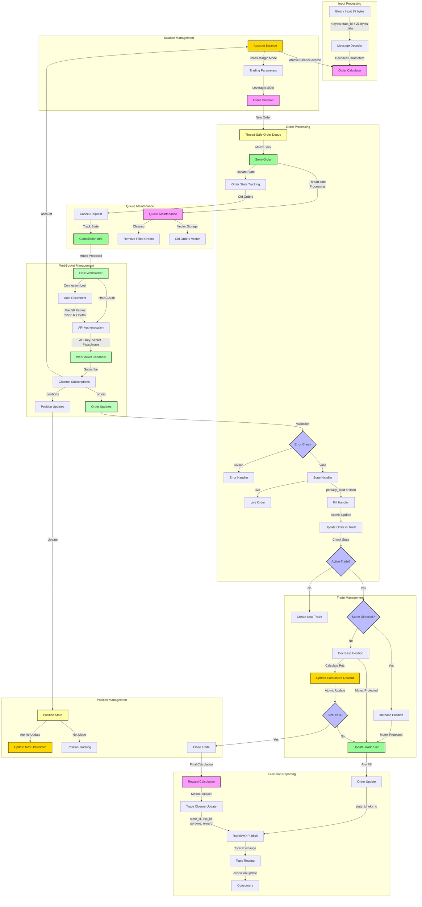

# OMS Service

A high-performance, event-driven order management system for cryptocurrency trading on the OKX exchange, operating in cross-margin mode.

## Technical Architecture

### Core Components
- **OMSHandler**: Main service coordinator managing trade state and message processing
- **OKXWebSocket**: Real-time market connection with automatic reconnection
- **Trade Management**: Position and order tracking with reward calculation
- **Order Processing**: Thread-safe order management with deque-based queue
- **Execution Reporting**: Real-time trade execution updates with reward metrics

### Key Features
- Event-driven architecture with thread-safe operations
- Real-time WebSocket communication with automatic reconnection (max 50 retries)
- Automatic trade closure with reward calculation
- Position mode: Net
- Execution tracking and reporting
- Maximum drawdown tracking (atomic)
- PnL-based reward calculation
- Thread-safe order management with mutex protection

## Operational Flow



## Message Processing

### Input Format
- Binary format (25 bytes)
- 4 bytes: State ID
- 21 bytes: Action data (V2 format)

### Order States
- live
- partially_filled
- filled
- canceled

### Order Information Tracking
```cpp
struct OrderInfo {
    uint32_t state_id;           // Internal state ID from input
    double volume;               // Original order volume
    double price;                // Original order price
    std::string okx_order_id;    // OKX order ID
    bool has_okx_id;             // Flag indicating if OKX ID is set
    double filled_size;          // Actual filled size
    double avg_fill_price;       // Average fill price
    bool is_filled;              // Whether the order is filled
    double execution_percentage;  // Track percentage of order executed
    std::string order_state;     // Track order state
}
```

### Execution Updates
Two types of execution messages are published:

1. **Order Execution**
```json
{
    "state_id": <uint32>,
    "okx_id": "<string>",
    "is_trade_closed": false
}
```

2. **Trade Closure**
```json
{
    "state_id": <uint32>,
    "okx_id": "<string>",
    "is_trade_closed": true,
    "filled_portions": [
        {"<okx_id>": <execution_percentage>},
        ...
    ],
    "reward": <double>
}
```

Note: All fills (partial or complete) generate an execution message, except when transitioning from partially filled to fully executed state.

## Trade Management

### Position Tracking
- Net position mode
- Automatic direction switching
- Size accumulation/reduction
- Execution percentage tracking
- Atomic maximum drawdown monitoring
- Cumulative reward calculation

### Reward Calculation
- Tracks cumulative reward during trade lifecycle
- Considers PnL for each position reduction
- Final reward calculation:
  - For positive cumulative reward: reward = cumulative_reward * (1 - 2 * |maxdd|)
  - For negative cumulative reward: reward = cumulative_reward * (1 + 2 * |maxdd|)
- Incorporates maximum drawdown impact on final reward

### Order Lifecycle
1. Order creation and thread-safe queueing
2. WebSocket confirmation with retry mechanism
3. Execution tracking with percentage calculation
4. Trade closure handling
5. Reward calculation
6. Execution reporting

## WebSocket Integration

### Connection Details
- Host: ws.okx.com
- Port: 8443
- Path: /ws/v5/private
- Protocol: ws
- RX Buffer Size: 65536
- Max Retries: 50

### Channels
- orders
- positions
- account

### Authentication
- API Key
- Secret Key
- Passphrase

## Thread Safety & Concurrency

### Mutex Protection
- Orders mutex for deque access
- Old orders mutex for cancellation tracking
- WebSocket connection mutex
- Balance atomic variables

### Atomic Operations
- Initial balance tracking
- Connection state
- Maximum drawdown updates

## Risk Management

### Order Controls
- Thread-safe order processing
- Automatic cancellation tracking
- Maximum drawdown monitoring (atomic)
- Execution percentage tracking

### Queue Management
- Thread-safe deque operations
- Automatic cleanup of filled orders
- Cancellation state tracking
- Old order processing

## Configuration

### Environment Variables
- OKX_API_KEY
- OKX_SECRET_KEY
- OKX_PASSPHRASE
- RABBITMQ_HOST
- RABBITMQ_PORT
- RABBITMQ_USER
- RABBITMQ_PASS

### Trading Parameters
- Leverage: 100x
- Minimum Contract Size: 0.1
- Trading Pair: BTC-USDT-SWAP

## Operational Notes

### Cross-Margin Mode
- Operating in cross-margin mode
- Automatic margin calculation
- Balance-based position sizing

### Position Management
- Net position tracking
- Automatic trade closure
- Direction switching support
- Partial fill support
- Atomic maximum drawdown monitoring
- Thread-safe order processing 