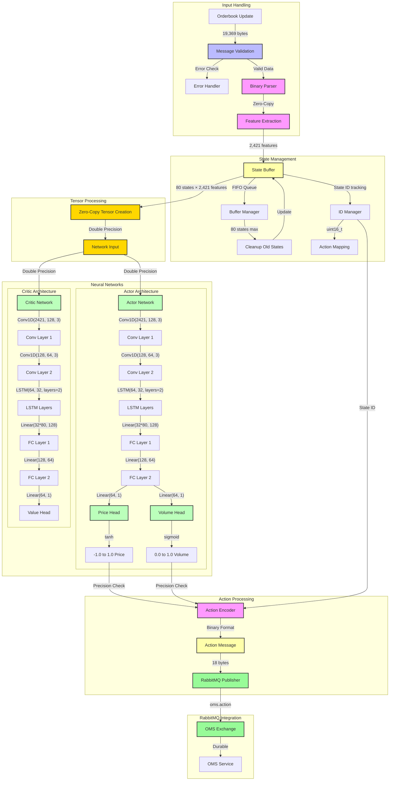

# PPO Service

## Overview
The PPO Service is a high-performance C++ application implementing Proximal Policy Optimization (PPO) algorithm for high-frequency trading. The service processes real-time orderbook data to generate trading decisions using a sophisticated neural network-based PPO algorithm with double precision (float64) computation.

## Features
- Real-time orderbook state processing
- Double precision (float64) neural networks with Conv1D and LSTM layers
- Fixed-size rolling state buffer (80 states)
- Binary message encoding/decoding
- RabbitMQ integration with durable exchanges
- State ID tracking for action correspondence
- Zero-copy tensor creation
- Graceful shutdown handling
- Signal handling (SIGINT, SIGTERM)
- Environment variable configuration
- Automatic reconnection logic
- Periodic model saving and loading

## Architecture

### Data Flow
```
[OKX Orderbook Service] ---> [RabbitMQ] ---> [PPO Service]
           |                                       |
           |                                       v
    Market Data Stream                    Binary Trading Actions
    (19,369 bytes per state)             (18 bytes per action)
```

## Scheme



### Components

1. **State Buffer**
   - Fixed size: 80 states (NETWORK_INPUT_SIZE constant)
   - History buffer size: 1000 states (HISTORY_BUFFER_SIZE constant)
   - Action buffer size: 1000 actions (ACTION_BUFFER_SIZE constant)
   - FIFO implementation using std::deque
   - Each state contains:
     * 400 bid levels (price, volume, orders) = 1,200 features
     * 400 ask levels (price, volume, orders) = 1,200 features
     * Mid price change = 1 feature
     * Market features at 5 depths:
       - Volume imbalance (5 features)
       - Order imbalance (5 features)
       - Bid VWAP change (5 features)
       - Ask VWAP change (5 features)
     * State ID (2 bytes) for tracking
     * Total: 1,200 + 1,200 + 1 + (5 × 4) = 2,421 features per state

2. **PPO Neural Networks**
   - **Actor Network** (double precision):
     * Input: [batch_size, sequence_length=80, features=2421]
     * Architecture:
       - Conv1D(2421, 128, kernel_size=3, padding=1)
       - Conv1D(128, 64, kernel_size=3, padding=1)
       - LSTM(64, 32, num_layers=2, batch_first=true)
       - Linear(32 * 80, 128) + ReLU
       - Linear(128, 64) + ReLU
       - Price Head: Linear(64, 1) + tanh
       - Volume Head: Linear(64, 1) + sigmoid
     * Outputs:
       - Price: -1 to 1 (relative to current price)
       - Volume: 0 to 1 (position size)

   - **Critic Network** (double precision):
     * Input: Same as Actor
     * Architecture:
       - Conv1D(2421, 128, kernel_size=3, padding=1)
       - Conv1D(128, 64, kernel_size=3, padding=1)
       - LSTM(64, 32, num_layers=2, batch_first=true)
       - Linear(32 * 80, 128) + ReLU
       - Linear(128, 64) + ReLU
       - Value Head: Linear(64, 1)
     * Output: State value estimation

3. **Message Handling**
   - Subscribes to 'orderbook' exchange with 'orderbook.updates' routing key
   - Publishes to 'oms' exchange with 'oms.action' routing key
   - Event-driven processing with RabbitMQ consumer polling
   - Automatic channel and exchange declaration
   - Durable queues and exchanges
   - Error handling and reconnection logic
   - State ID tracking for action-state correspondence
   - Signal handling for graceful shutdown

## Message Formats

### Input (Orderbook Updates)
Received from 'orderbook' exchange with 'orderbook.updates' routing key:

Binary Message Format:
```
[Bids Array: 400 levels × 3 uint64_t values]
- Each level:
  * Price (8 bytes): 1 bit sign + 63 bits fraction
  * Volume (8 bytes): 1 bit sign + 10 bits whole + 53 bits fraction
  * Orders (8 bytes): 1 bit sign + 10 bits whole + 53 bits fraction
- Total: 400 × 24 bytes = 9,600 bytes
- Sorted in descending order by price

[Asks Array: 400 levels × 3 uint64_t values]
- Same format as bids
- Total: 400 × 24 bytes = 9,600 bytes
- Sorted in ascending order by price

[Market Features]
- Mid price change (8 bytes)
- Market features at 5 depths (10, 20, 50, 100, 400):
  * Volume imbalance (5 × 8 bytes)
  * Order imbalance (5 × 8 bytes)
  * Bid VWAP change (5 × 8 bytes)
  * Ask VWAP change (5 × 8 bytes)
- Total: 169 bytes

[State ID]
- 2 bytes (uint16_t)
- Used for action-state correspondence
- Range: 0-65535

Total message size: 19,369 bytes
```

### Output (Trading Actions)
Published to 'oms' exchange with 'oms.action' routing key in optimized binary format:

Message Structure (18 bytes total):
```
Byte 0:    Action type (3 bits, 0 = new order)
Bytes 1-8: Price (1 bit sign + 63 bits fraction)
Bytes 9-16: Volume (1 bit boundary + 63 bits fraction)
Byte 17-18:   State ID (matches the state that triggered the action)
```

Binary Format Details:
- **Action Type** (1 byte):
  * First 3 bits used (0-7 possible values)
  * 0 = new order
  * 5 bits reserved for future use

- **Price** (8 bytes):
  * Format: 1 bit sign + 63 bits fraction
  * Sign bit: 0 for positive, 1 for negative
  * Fraction: value * (2^63 - 1)
  * Range: [-1.0, 1.0] (relative to current price)
  * Zero values encoded as 0
  * Precision threshold: 1e-15

- **Volume** (8 bytes):
  * Format: 1 bit boundary + 63 bits fraction
  * Boundary bit: 1 if volume ≥ 1.0
  * Fraction: clamped_value * (2^63 - 1)
  * Range: [0.0, 1.0] (position size)
  * Zero values encoded as 0
  * Precision threshold: 1e-15

- **State ID** (2 bytes):
  * Unsigned integer (0-65535)
  * Matches the ID of the state that triggered this action
  * Used for end-to-end state tracking

## Neural Network Details

### Network Precision
- All computations use double precision (float64)
- Input tensors: torch::kFloat64
- Network weights: torch::kFloat64
- Output tensors: torch::kFloat64
- No precision loss in data pipeline

### PPO Hyperparameters
- Clip epsilon: 0.2
- Value coefficient: 0.5
- Entropy coefficient: 0.01
- PPO epochs: 2
- Mini-batch size: 16
- Learning rate: 0.0003
- Training buffer size: 100 trades
- Model save interval: Every 9000 states

## Dependencies

- C++17 or higher
- CMake 3.10 or higher
- LibTorch 2.1.0 (CPU) with double precision support
- RabbitMQ C client library
- nlohmann-json

## Building

1. Install dependencies:
```bash
# Ubuntu/Debian
sudo apt-get update
sudo apt-get install -y cmake g++ librabbitmq-dev nlohmann-json3-dev
# Install LibTorch 2.1.0 from PyTorch website

# macOS
brew install cmake rabbitmq-c nlohmann-json
# Install LibTorch 2.1.0 from PyTorch website
```

2. Build the service:
```bash
mkdir build && cd build
cmake ..
make
```

## Configuration

Environment variables:
- `RABBITMQ_HOST`: RabbitMQ server host (default: "localhost")
- `RABBITMQ_PORT`: RabbitMQ server port (default: 5672)
- `RABBITMQ_USERNAME`: RabbitMQ username (default: "guest")
- `RABBITMQ_PASSWORD`: RabbitMQ password (default: "guest")

## Docker Support

Run with Docker:
```bash
docker build -t ppo-service .
docker run -d \
  --name ppo-service \
  -e RABBITMQ_HOST=rabbitmq \
  -e RABBITMQ_PORT=5672 \
  -e RABBITMQ_USERNAME=guest \
  -e RABBITMQ_PASSWORD=guest \
  ppo-service
```

Or use docker-compose (see docker-compose.yml).

## Performance

- Message processing: Event-driven with RabbitMQ consumer polling
- Forward pass latency: Double precision computation
- Memory footprint: ~100MB
- State buffer size: ~20MB (80 states × ~250KB per state)
- Zero-copy tensor creation from state buffer
- Optimized binary message encoding/decoding
- State ID tracking overhead: 2 bytes per message
- Automatic reconnection on RabbitMQ connection loss
- Graceful shutdown with proper cleanup

## Limitations

- Single instrument support only
- CPU-only inference
- Fixed buffer size (80 states)
- No dynamic hyperparameter tuning
- No persistence between restarts
- No GPU support currently
- State ID wraps around after 65535
- No support for dynamic network architecture changes